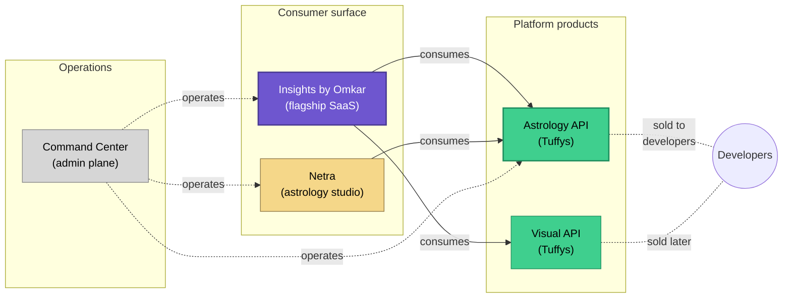

# Portfolio strategy · Insights by Omkar

**Owner** · Omkar Jaliparthi
**LLC** · Omkar's Holistic Services LLC · DBA *Insights by Omkar* · formed May 2023
**As of** · 2026-04-20

---

## One sentence

A studio building one consumer-facing flagship and three platform-grade products that power it — each earning its independence by serving the flagship first, external customers second.

## Why this shape

Solo operators face a forcing constraint: every product needs to either pay for itself or *make a different product better*. A product that does neither is a tax on the others. The portfolio is organized so every asset meets at least one of those tests, and the highest-leverage assets meet both.

The organizing principle is **dogfood-first**: the consumer flagship is the first paying customer of every platform product in the portfolio. External customers come after a platform product has been battle-tested internally.

## The five products

| # | Product | What it is | Role in the portfolio | Audience |
|---|---|---|---|---|
| 1 | **Insights by Omkar** | Consumer AI SaaS (live) | **Flagship** — the product users pay for directly | Consumers |
| 2 | **Insights Astrology API** *(Tuffys)* | Commercial astronomy API (live) | Platform — powers flagship astrology; sold to developers | Developers |
| 3 | **Netra** | Browser-native astrology studio | Flagship-adjacent — the visual UX layer on top of the API | Consumers (via flagship) + direct users |
| 4 | **Tuffys Visual API** | Generative-visual ecosystem | Platform — powers visual content across the flagship | Internal first, developers later |
| 5 | **Command Center** | Admin control plane | Operational — unifies admin for the three revenue products | Internal only |

All five are actively developed. Only (1) and (2) currently have external revenue paths; (3) and (4) will follow once their flagship use-case is battle-tested.

## How they relate

## Why this order

The sequence is not arbitrary. Each product is a prerequisite for the next.

1. **Flagship first.** Without a consumer product, there is no internal customer for the platform products. Platform-first is a common solo-operator trap — it produces generic APIs with no opinions.
2. **API after flagship.** An astrology API written to power a specific consumer experience has strong opinions about ergonomics. An astrology API written first is a thin wrapper over almanac data.
3. **Netra after the API is stable.** Extracting the studio from the SaaS required the API to be a clean boundary. See [ADR 0003 · Monorepo split](./adrs/0003-monorepo-split-netra-extraction.md).
4. **Visual API parallel to content work.** Visual needs the flagship's content pipeline as its first hard user; shipping visual-first would produce a demo, not a product.
5. **Command Center last, because it exists to manage the first four.** An admin plane built before there was anything to admin would be premature.

## How new products enter the portfolio

A candidate product must answer all three:

1. **What will it dogfood?** If it has no internal customer for the first six months, it will drift.
2. **What does it take off the flagship's plate?** Every platform product must absorb a concern that the flagship otherwise carries.
3. **What is its external path?** Not a revenue projection — a written answer to "who pays for this alone, and why not just build it in the flagship?"

A candidate that can only answer the third is a startup idea, not a portfolio product. A candidate that can only answer the first two is a feature, not a product.

## What stays out of the portfolio

- **Tools I use for my own delivery.** Internal-only automation stays internal; it does not get promoted to a product unless there's demand.
- **Speculative market bets** not anchored to the flagship. A "generic tarot API for third parties" with no flagship use-case would fail the dogfood test.
- **Acquisitions or white-labels** that don't sit cleanly in the diagram above.

## Trademark and IP posture

- **Trademarks** · the names above (*Insights by Omkar*, *Tuffys*, *Netra*) are the studio's brand surface. Visible public use in commerce strengthens trademark filings.
- **Trade secrets** · algorithmic work inside the platform products (the ephemeris engine most notably) is trade-secret; nothing in this portfolio doc describes mechanism, only boundaries.
- **Open source** · SDKs for external consumption are MIT. Server implementations are not open source and will not be for the foreseeable future.

## Release cadence across products

Each product ships on its own cadence. Coordination happens only where contracts cross repo boundaries — a breaking API change coordinates with the flagship's dependency bump; everything else is independent. See [ADR 0004 · Release cadence philosophy](./adrs/0004-release-cadence-philosophy.md).

## Measurement

Portfolio health is measured by four numbers:

- **Flagship revenue** — the only external revenue signal that matters at this stage
- **External API customers** — leading indicator for platform independence from the flagship
- **Cross-product bug surface** — incidents whose root cause crosses two products; this number should trend down as boundaries harden
- **Time-to-ship per product** — independent; a portfolio-level improvement only matters if it doesn't come at another product's expense

---

*This strategy doc is a snapshot. It will be revised when a product enters, exits, or changes role.*

*Related reading · [ADR 0003 · Monorepo split](./adrs/0003-monorepo-split-netra-extraction.md) · [Pricing & packaging](./pricing-and-packaging.md) · [Case study · Insights by Omkar](https://github.com/omkarjaliparthi/insights-by-omkar-case-study)*
