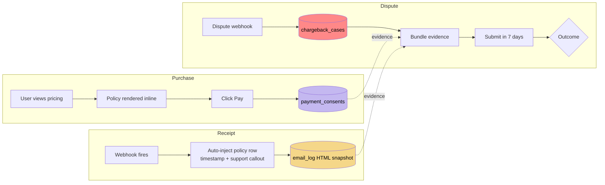

# PRD · Chargeback Defense Infrastructure

**Status** · Shipped v2.0.7 · 2026-04-07
**Owner** · Omkar Jaliparthi · Founder / Product / Program
**Product** · Insights by Omkar · insightsbyomkar.com

---

## 1. Problem

High-emotion consumer purchases carry chargeback rates of 0.5–1.5% vs. ~0.1% for normal e-commerce.

Cross a processor's threshold (Stripe: 0.75%) → merchant account paused or terminated. One bad week can kill the business.

Without proactive defense, every dispute reaches the bank with **no merchant evidence**. Merchants lose ~90% of the time. Flip that.

## 2. Stakeholders

- **Customers** — need obvious non-chargeback escape paths (clear support, visible refund terms) so disputes aren't the first option
- **Operations (me)** — need fast, complete evidence bundles when disputes open
- **Payment processors** — need to see a low-risk merchant with good hygiene

## 3. Goals

- **P0** — chargeback rate below 0.3% sustained
- **P1** — win ≥60% of disputes via evidence submission
- **P2** — dashboards + alerts surface trends before thresholds hit

## 4. Non-goals

- No human review of every purchase — doesn't scale
- No fraud-scoring ML — overkill at current volume, re-evaluate at 10×
- No "one-click dispute" UI — don't surface the option that costs us money

## 5. Success metrics

| Metric | Target | How measured |
|---|---|---|
| Chargeback rate | <0.3% of transactions | 30-day rolling window, per-processor |
| Dispute win rate | ≥60% | `chargeback_cases.resolution = won / total_disputed` |
| Evidence completeness | 100% of disputes have attached package | Auto-check on case create |
| Time-to-evidence | <24 hr from dispute open to submitted | Audit log timestamps |

## 6. Requirements

### 6.0 Evidence chain overview

### 6.1 Data model

Three tables form the defense layer:

- **`payment_consents`** — which pricing page, what policy version, timestamp, IP, user-agent
- **`chargeback_cases`** — processor dispute ID, status, evidence bundle JSON, resolution
- **`email_log`** — every transactional email · HTML snapshot + sender + recipient + template + timestamp

### 6.2 Receipt requirements

Every payment receipt must include:

1. Amber "Questions about this charge?" callout · support email + policy URL
2. `"Charged on [date/time PDT]"` — timestamped proof
3. Product-specific policy row (e.g., *"Credits are non-refundable once added."*)
4. Footer: *"By completing this purchase you agreed to our Refund & Cancellation Policy"* with link

### 6.3 Policy engine

- Per-product policies in `credit_package_refund_policies` and `appointment_type_refund_policies`
- Policy version stamped on every receipt + consent row
- Admin-editable, no code deploy

### 6.4 Admin dispute dashboard · *v2*

- Per-product dispute rate trendline
- Threshold alerts when approaching 0.5%
- Pre-filled evidence package generator

## 7. Risks

| Risk | Mitigation |
|---|---|
| Over-enforcement drives user anger | Amber callout is warm-toned, not legalistic. Support routes convert ~30% of would-be chargebacks into refunds. |
| Policy versioning drift | Every consent row stamps policy version hash. Replay attacks caught. |
| Processor hold before trend surfaces | v2 dashboard + thresholds. Meanwhile, weekly manual monitoring. |

## 8. Launch plan

- **v1 · shipped v2.0.7** — data model + receipt evidence-stamping + policy engine
- **v2 · planned** — dispute dashboard + threshold alerts + pre-dispute save flow
- **v3 · planned** — per-customer risk scoring

## 9. Decision log

- **Why not Lemon Squeezy / Paddle (MoR)?** Higher fees, less control. Enterprise buyers later prefer direct processor relationships.
- **Why Stripe + PayPal from v2.0?** See [RFC · Dual Payment Rails](../rfcs/dual-payment-rails.md). Chargeback redundancy was a primary driver.
- **Why not surface refund option in-product?** Measurably increases refund rate. Keep in support flow, not primary UX.
