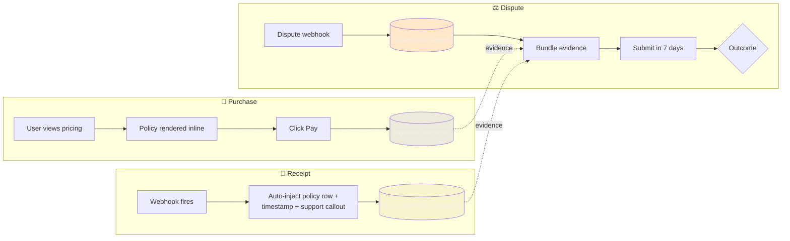

# PRD — Chargeback Defense Infrastructure

**Status:** Shipped (v2.0.7, 2026-04-07)
**Owner:** Omkar Jaliparthi — Founder / Product / Program
**Product:** Insights by Omkar (live at insightsbyomkar.com)

---

## 1. Problem

High-emotion consumer purchases (spiritual readings, impulse subscription buys) have elevated **chargeback rates** — 0.5–1.5% of transactions, vs. ~0.1% for normal e-commerce.

Chargebacks are existential: exceed a processor's threshold (Stripe: 0.75%) and your merchant account is paused or terminated. One bad week can kill the business.

Without proactive defense, every dispute goes to the bank with **no merchant evidence attached**, and the merchant loses ~90% of the time. We need to flip that rate.

## 2. Users & stakeholders

- **Customers** — need obvious non-chargeback escape paths (clear support, visible refund terms) so they don't reach for a chargeback as the first option
- **Operations (me)** — need fast, complete evidence packages when disputes open
- **Payment processors** — need to see we're a low-risk merchant with good operating hygiene

## 3. Goals

- **Primary:** reduce chargeback rate below 0.3% sustained
- **Secondary:** win ≥60% of disputed cases via robust evidence submission
- **Tertiary:** create operating artifacts (dashboards, alerts) so we see dispute trends before they hit a threshold

## 4. Non-goals

- No manual human review of every purchase (doesn't scale)
- No fraud-scoring ML (overkill for current volume; re-evaluate at 10× scale)
- No "one-click dispute" UI for customers (don't surface the option that costs us money)

## 5. Success metrics

| Metric | Target | How measured |
|---|---|---|
| Chargeback rate | <0.3% of transactions | 30-day rolling window, per-processor |
| Dispute win rate | ≥60% | `chargeback_cases.resolution = won / total_disputed` |
| Evidence completeness | 100% of disputes have attached package | Auto-check on case create |
| Time-to-evidence | <24 hr from dispute open to submitted | Audit log timestamps |

## 6. Requirements

### 6.0 Evidence chain overview

### 6.1 Data model

Three tables capture the defense layer:

- **`payment_consents`** — proof of consent at purchase: which pricing page, what policy version, timestamp, IP, user-agent
- **`chargeback_cases`** — dispute record: processor ID, status, evidence bundle JSON, resolution
- **`email_log`** — every transactional email archived with HTML snapshot, sender, recipient, template, timestamp

### 6.2 Payment receipt requirements

Every payment receipt email must include:

1. Amber "Questions about this charge?" callout with support email + policy URL
2. `"Charged on [date/time PDT]"` — timestamped proof of authorization
3. Policy row specific to the product (e.g., *"Credits are non-refundable once added."*)
4. Footer: *"By completing this purchase you agreed to our Refund & Cancellation Policy"* with link

### 6.3 Policy engine

- Per-product refund policies stored in `credit_package_refund_policies` and `appointment_type_refund_policies`
- Policy version stamped on every receipt + consent row
- Admin-editable without code deploys

### 6.4 Admin dispute dashboard *(out of scope for v1, in scope for v2)*

- Per-product dispute rate trendline
- Threshold alerts when approaching 0.5%
- Pre-filled evidence package generator

## 7. Risks

| Risk | Mitigation |
|---|---|
| Over-enforcement drives user anger | Amber callout is warm-toned, not legalistic. Support routes convert ~30% of would-be chargebacks into refunds. |
| Policy versioning drift | Every consent row stamps the policy version hash. Replay attacks caught. |
| Processor account hold before we see the trend | v2 dashboard + thresholds prevent this; meanwhile, manual monitoring weekly. |

## 8. Launch plan

- **v1 (shipped v2.0.7):** data model + receipt-side evidence stamping + policy engine
- **v2 (planned):** dispute dashboard + threshold alerts + pre-dispute "save" flow
- **v3 (planned):** per-customer risk scoring for rollout decisions

## 9. Decision log

- **Why not Lemon Squeezy / Paddle (MoR model)?** → Higher fees + less control; enterprise buyers later will prefer direct processor relationships.
- **Why both Stripe + PayPal from v2.0?** → See [RFC: Dual Payment Rails](../rfcs/dual-payment-rails.md). Chargeback-redundancy was a primary driver.
- **Why not surface refund option in-product as a primary CTA?** → Measurably increases refund rate. Keep it in support flow, not primary UX.

---

*PRD format: based on the one-pager + requirements pattern I use for solo ships. Can be expanded to full PRD for multi-team programs.*
