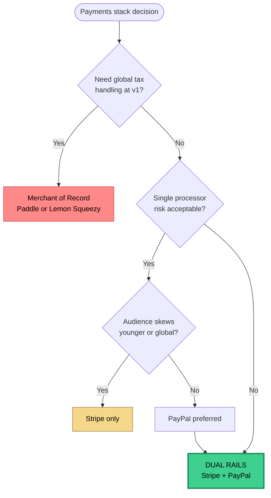

# RFC · Dual Payment Rails (Stripe + PayPal)

**Status** · Accepted & Shipped · v2.0 · 2026-03-25
**Author** · Omkar Jaliparthi
**Program** · Insights by Omkar

---

## Context

At v1.2 (2026-03-10), Stripe was live for subscriptions + credit packs. Pre-launch decision: add a second payment rail?

Two revenue paths:
- **Subscriptions** — 4 tiers (Lucky Pro M/A, Lucky Max M/A)
- **Credit packs + impulse packages** — pay-per-reading

## Options

### Option A — Stripe only (status quo)

**Pros:**
- Best-in-class DX and subscription primitives
- One webhook surface, one reconciliation path
- Already shipped and working

**Cons:**
- Segments (especially older users) prefer PayPal
- Account reviews can freeze the whole business
- No rail-failover for outages

### Option B — PayPal only

**Pros:**
- Broad trust, international reach
- Lower friction for first-time online buyers

**Cons:**
- Subscription API is substantially worse than Stripe
- Developer ergonomics painful
- Harder reconciliation

### Option C — Stripe + PayPal (dual rails) ✅

**Pros:**
- Meet users where their wallet already is
- Redundancy — if one processor freezes, the other keeps revenue flowing
- Chargeback surfaces split across both processors
- Small segments prefer one or the other

**Cons:**
- 2× webhook surface (signature verification, idempotency)
- 2× reconciliation logic
- 2× fraud models
- Larger test matrix

### Option D — Lemon Squeezy or Paddle (Merchant of Record)

**Pros:**
- Handles global tax + compliance
- One integration

**Cons:**
- Higher fees (~8% vs 2.9%)
- Less control
- Enterprise buyers later will prefer direct processor relationships

### Scoring the options

| Dimension (weight) | A: Stripe only | B: PayPal only | **C: Dual rails** | D: MoR |
|---|:-:|:-:|:-:|:-:|
| User trust / conversion (×3) | 🟡 6 | 🟢 8 | 🟢 **9** | 🟡 7 |
| DX / velocity (×2) | 🟢 9 | 🔴 4 | 🟡 7 | 🟢 8 |
| Chargeback resilience (×3) | 🔴 4 | 🔴 4 | 🟢 **9** | 🟡 6 |
| Unit economics (×2) | 🟢 9 | 🟡 7 | 🟢 8 | 🔴 4 |
| Ops complexity (inverted, ×1) | 🟢 9 | 🟡 7 | 🟡 6 | 🟢 9 |
| **Weighted total** | 65 | 55 | **78** | 64 |

### Decision flow

## Decision

**Option C — dual rails, Stripe primary + PayPal secondary.** Highest weighted score (78 vs next 65), strongest chargeback resilience which was the gating concern.

## Rationale

1. **Trust surface.** Skeptical buyers — especially older demographics — have PayPal accounts and won't enter card details on a new site.
2. **Processor redundancy.** High-emotion purchases carry elevated dispute risk. One processor can't kill the business.
3. **Unit economics hold.** Fee differential (Stripe 2.9%+30¢ vs PayPal 3.49%+49¢) is small vs. the cost of a lost customer or frozen account.

## Implementation

- `PaymentProvider` interface · abstracts checkout session, webhook verification, subscription state mapping
- `payments/stripe/*` and `payments/paypal/*` implement the interface
- App code branches on normalized state only: `active | past_due | canceled | refunded | disputed`
- Two webhook routes: `/api/billing/webhook` (Stripe), `/api/billing/paypal-webhook` (PayPal)
- Both sign-verify incoming payloads before processing

## Testing

Pre-launch (v2.0):

- [x] Full test loop both rails · checkout → webhook → credits delta → refund → reversal
- [x] Dispute simulation · test chargeback → `chargeback_cases` row + evidence-stamped email logged
- [x] Subscription lifecycle · upgrade, downgrade, cancel → webhook → UI state

## Rollout

- v2.0 — PayPal behind `PAYMENTS_PAYPAL_ENABLED` flag
- v2.0.1 — flag removed · PayPal button default at checkout

## Follow-ups

- Build `PaymentProvider` abstraction at v1.0 next time. Retrofitting cost ~1.5 days.
- Instrument per-rail conversion at checkout to learn which rail converts better for which audience.
