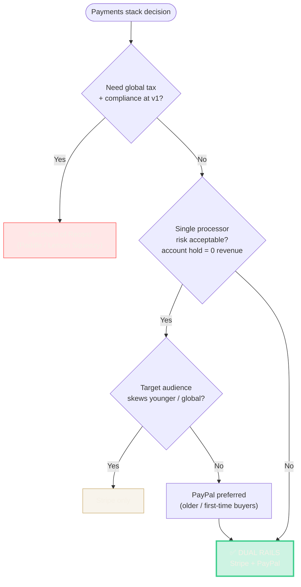

# RFC — Dual Payment Rails (Stripe + PayPal)

**Status:** Accepted & Shipped (v2.0, 2026-03-25)
**Author:** Omkar Jaliparthi
**Program:** Insights by Omkar

---

## Context

At v1.2 (2026-03-10), Insights by Omkar had Stripe live for subscriptions + credit packs. Ahead of public launch, we needed to decide whether to add a second payment rail.

Two revenue paths:
- **Subscriptions** — 4 tiers (Lucky Pro Monthly/Annual, Lucky Max Monthly/Annual)
- **Credit packs + impulse packages** — pay-per-reading

## Options

### Option A — Stripe only (status quo)

**Pros:**
- Best-in-class DX and subscription primitives
- One webhook surface, one reconciliation path
- Already shipped and working

**Cons:**
- Segments (especially older users) prefer PayPal
- Account reviews can freeze the whole business
- No rail-failover for outages

### Option B — PayPal only

**Pros:**
- Broad trust, international reach
- Lower friction for first-time online buyers

**Cons:**
- Subscription API is substantially worse than Stripe
- Developer ergonomics painful
- Harder reconciliation

### Option C — Stripe + PayPal (dual rails) ✅

**Pros:**
- Meet users where their wallet already is
- Redundancy — if one processor freezes, the other keeps revenue flowing
- Chargeback surfaces split across both processors
- Small segments prefer one or the other

**Cons:**
- 2× webhook surface (signature verification, idempotency)
- 2× reconciliation logic
- 2× fraud models
- Larger test matrix

### Option D — Lemon Squeezy or Paddle (Merchant of Record)

**Pros:**
- Handles global tax + compliance
- One integration

**Cons:**
- Higher fees (~8% vs 2.9%)
- Less control
- Enterprise buyers later will prefer direct processor relationships

### Scoring the options

| Dimension (weight) | A: Stripe only | B: PayPal only | **C: Dual rails** | D: MoR |
|---|:-:|:-:|:-:|:-:|
| User trust / conversion (×3) | 🟡 6 | 🟢 8 | 🟢 **9** | 🟡 7 |
| DX / velocity (×2) | 🟢 9 | 🔴 4 | 🟡 7 | 🟢 8 |
| Chargeback resilience (×3) | 🔴 4 | 🔴 4 | 🟢 **9** | 🟡 6 |
| Unit economics (×2) | 🟢 9 | 🟡 7 | 🟢 8 | 🔴 4 |
| Ops complexity (inverted, ×1) | 🟢 9 | 🟡 7 | 🟡 6 | 🟢 9 |
| **Weighted total** | 65 | 55 | **78** | 64 |

### Decision flow

## Decision

**Option C — dual rails, Stripe primary + PayPal secondary.** Highest weighted score (78 vs next 65), strongest chargeback resilience which was the gating concern.

## Rationale

1. **Trust surface.** Consumer wellness attracts skeptical buyers — especially older demographics who have PayPal accounts but won't enter card details on a new site.

2. **Chargeback surface.** High-emotion purchases have elevated dispute risk. Splitting rails means no single processor's risk model can kill the business.

3. **Unit economics still work.** Fee differential (Stripe ~2.9%+30¢ vs PayPal ~3.49%+49¢) is small relative to the cost of a lost customer at checkout or a paused processor account.

## Implementation

- Add a `PaymentProvider` interface abstracting checkout session creation, webhook verification, subscription state → app state mapping
- `payments/stripe/*` and `payments/paypal/*` modules implement the interface
- App-level code never branches on provider — only on normalized state (`active | past_due | canceled | refunded | disputed`)
- Two separate webhook routes: `/api/billing/webhook` (Stripe), `/api/billing/paypal-webhook` (PayPal)
- Both webhook routes sign-verify their incoming payloads before processing

## Testing

Before go-live (v2.0):

- [x] Full test-mode loop both rails: checkout → webhook → credits delta → refund → webhook → reversal
- [x] Chargeback simulation: manually open test dispute, confirm `chargeback_cases` row + email log created with timestamped evidence
- [x] Subscription lifecycle: upgrade, downgrade, cancel in portal → webhook downgrade → UI state

## Rollout

- v2.0 — PayPal live behind feature flag `PAYMENTS_PAYPAL_ENABLED`
- v2.0.1 — flag removed; PayPal button shown at checkout for all users

## Follow-ups / lessons

- **Retrospective:** should have built the `PaymentProvider` abstraction at v1.0 even with only Stripe implemented. Retrofitting was ~1.5 days of unnecessary refactor.
- **Next:** instrument per-rail conversion rate at checkout to learn which rail converts better for which audience.

---

*RFC format: I use a compact variant of the Ovoid / Rust RFC style — Context → Options → Decision → Rationale → Implementation → Testing → Rollout. Lives alongside code in a `/rfcs` folder.*
