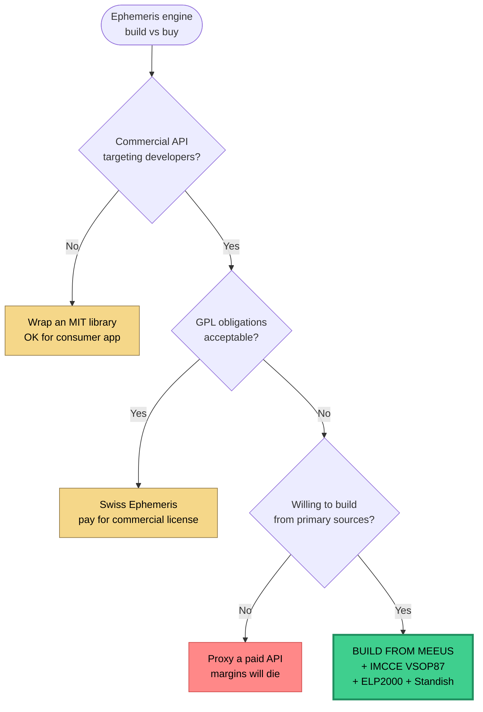

# RFC · Home-Grown Ephemeris Engine — Build vs Buy

**Status** · Accepted & Shipped · 2026-04-15
**Author** · Omkar Jaliparthi
**Program** · Insights Astrology API · v1.0 launch

---

## Context

The v0 product (March 2026) used `circular-natal-horoscope-js` — a light MIT library that wrapped rough planetary position math good enough for a consumer reading UI. For v1 (a commercial API targeting developer customers paying $49+/mo for accuracy and uptime) that was no longer defensible.

The v1 product needs to answer, on day one, every question a sophisticated astrology customer asks:

- *What's your Moon accuracy?*
- *Which Vedic ayanamsas do you support?*
- *Do you handle Placidus at high latitudes?*
- *What's your source for asteroid elements?*

Wrapping an approximation library forces evasive answers. Wrapping Swiss Ephemeris solves accuracy but ships a licensing grenade. Building from peer-reviewed primary sources is the hard-but-right path — if I can ship it in a timeframe that doesn't blow the launch window.

## Options

### Option A — Wrap `circular-natal-horoscope-js` (status quo)

**Pros:**
- Already integrated; zero rewrite risk
- MIT licensed, commercial use unrestricted
- Small bundle

**Cons:**
- Accuracy insufficient for commercial claims (multi-degree errors under stress)
- No Vedic / Hellenistic / electional coverage
- No house system variety beyond the basics
- Can't publish an accuracy table without embarrassment
- The library is unmaintained; no one to escalate bugs to

### Option B — Wrap Swiss Ephemeris

**Pros:**
- Industry-standard accuracy (~0.001 arcsecond)
- Coverage: every tradition, every body, every era
- Decades of validation

**Cons:**
- **GPL v2 / commercial dual license.** GPL contaminates any derivative work — every SDK would have to ship source. Commercial license is negotiated per-deal with the upstream vendor, opaque pricing
- 100+ MB of ephemeris files must be shipped or hot-loaded — kills serverless cold-start budget
- C bindings in a Next.js/TypeScript stack add deploy complexity (`serverlessFunctions` size caps)
- Ships a dependency that is itself a monetized product — strategic exposure

### Option C — Paid hosted API (AstrologyAPI, Prokerala)

**Pros:**
- Zero build cost
- Fastest path to market
- Unit economics known

**Cons:**
- Per-request pricing eats margin at scale (gross margin <20% at Studio tier)
- **You cannot build a commercial API on top of someone else's commercial API.** First ToS review kills the business
- Latency stacks (their hop + ours)
- No differentiation — we'd be a thin proxy

### Option D — Build from primary sources (Meeus, IMCCE VSOP87, ELP2000, Standish) ✅

**Pros:**
- **All algorithms are public domain** (published in textbooks and academic FTP mirrors)
- Full control over accuracy claims, traditions, and response shapes
- Tree-shakeable TypeScript — serverless-friendly, no binary deps
- Permanent moat: once built, nobody can commoditize us without doing the same work
- The accuracy table becomes a marketing asset, not a liability
- Engineering rigor signals quality to technical customers (dev-tools buyers)

**Cons:**
- **~10K lines of non-trivial math** to write and verify — two sprints of focused work, high risk if a bug ships
- Must validate against an external reference (Meeus tables) — missing that validation = production incidents
- Ongoing burden to track precession/nutation/ΔT corrections over time
- Opportunity cost — same engineering hours could ship 3–4 other product features

### Scoring the options

Weights: accuracy (×3) because it's the product's core claim · licensing freedom (×3) because ToS risk is existential · time-to-ship (×2) · unit economics (×2) · long-term defensibility (×2) · operational complexity — inverted (×1).

| Dimension (weight) | A: wrap lib | B: Swiss Eph | C: hosted API | **D: from primary** |
|---|:-:|:-:|:-:|:-:|
| Accuracy (×3) | 🔴 3 | 🟢 10 | 🟢 9 | 🟢 **9** |
| Licensing freedom (×3) | 🟢 9 | 🔴 3 | 🔴 2 | 🟢 **10** |
| Time-to-ship (×2) | 🟢 10 | 🟡 6 | 🟢 10 | 🔴 4 |
| Unit economics at scale (×2) | 🟢 9 | 🟡 6 | 🔴 3 | 🟢 **10** |
| Long-term defensibility (×2) | 🔴 2 | 🟡 5 | 🔴 1 | 🟢 **10** |
| Ops complexity (inverted, ×1) | 🟢 9 | 🔴 4 | 🟢 9 | 🟡 6 |
| **Weighted total** | 75 | 74 | 73 | **98** |

### Decision flow

## Decision

**Option D — build from primary sources.** Weighted score 98 vs next 75. The accuracy + licensing + unit-economics axes are all existential for a commercial dev-tools business, and Option D wins all three. Time-to-ship is the only weakness — mitigated by scope discipline (§ Implementation plan) and a compressed validation loop (§ Testing strategy).

## Rationale

Three things tipped the decision:

1. **Licensing is the product.** Customers ship our math into their apps. If our engine carries a GPL chain or a "not for resale" ToS, every integration meeting becomes a legal review. That friction kills developer-tools sales.

2. **Margin is the business.** A hosted-API proxy at Studio-tier pricing is gross-margin negative at scale. We're not Stripe — we can't subsidize. First principles means the marginal cost of a request is CPU only.

3. **The moat has to be something.** If the engine is someone else's library, any competitor can do the same wrap in a weekend. The 10K lines of VSOP87 + ELP2000 + Vedic + Hellenistic math *is* the defensibility — and every month it's in production it accrues more golden-file validation, more edge-case coverage, and more customer lock-in via response-shape stability.

## Implementation plan

Scoped ruthlessly to what a solo engineer can ship in one day.

### Phase 1 — astronomical foundation (committed: `6299bd5`)

- Julian Day + ΔT conversion (Meeus ch. 9)
- Mean + nutation-corrected obliquity (Meeus ch. 21)
- Sidereal time (Meeus ch. 12)
- Ecliptic ↔ equatorial transforms
- Sun position (Meeus ch. 25, direct series)
- Moon position (ELP2000 truncated — Meeus ch. 47)
- Planets (Standish Keplerian — acceptable accuracy for v0)
- All major house systems — Whole-Sign, Equal, Porphyry, Placidus, Koch
- Aspects (major + minor + declination)
- Special points (nodes, Lilith, lots, vertex, midpoints, planetary nodes)
- Shared Kepler solver

### Phase 2 — tradition-specific layers (committed: `821342a`)

- **Vedic** — 5 ayanamsas, 27 nakshatras + padas, all 16 divisional charts (D1–D60), Vimshottari + Yogini + Ashtottari dashas, Panchanga, 12 yoga families, Chara karakas, KP sublords, Ashtakavarga, Shadbala
- **Hellenistic** — profections (annual + monthly), zodiacal releasing (L1–L4)
- **Electional** — sunrise/sunset (bisection), planetary hours (Chaldean), VOC moon, muhurta scoring, eclipse finder
- **Relational** — transits, synastry, composite, progressions (secondary + tertiary), solar arc, solar + lunar returns
- **Dignities** — domicile, exaltation, detriment, fall, triplicity, Egyptian terms, Chaldean faces, sect
- **Fixed stars** — 31-star catalog with precession drift

### Phase 3 — VSOP87 upgrade (committed: `abfce6d`)

- Upgrade Mercury–Neptune from Standish Keplerian (~1°) to VSOP87D (~1″)
- Pulls IMCCE FTP coefficients via `scripts/generate-vsop87.mjs` — parses fixed-width term format, emits tree-shakeable TypeScript modules
- Keplerian path retained for Pluto (no VSOP87 coverage)

### Phase 4 — HTTP layer (committed: `733da2e`)

- 43 v1 endpoints at launch under `app/api/v1/...` (now 109+ across nine semver versions)
- Stateless HS256 JWT auth with embedded per-key quotas
- Dual-window rate limiter (Upstash + in-process fallback)
- Strict ISO-8601 parser (rejects naive locals)
- Structured JSON request logger
- CORS-open with OPTIONS preflights
- `/openapi.json` generator

## Testing strategy

Golden-file validation is non-negotiable — it's the entire reason this RFC is viable.

- **Source of truth** — Meeus tables (published, peer-reviewed, reproducible)
- **Coverage** — 230+ assertions across 16 test files, every major algorithm has a golden reference
- **Example** — `bodies.test.ts` validates Sun position on 1992-10-13 against Meeus Appendix to within 0.01°, and Sun-Earth distance within 0.0005 AU
- **CI gate** — `npm test` runs on every PR; no merge without passing

Second layer: **spot-check against a Swiss Ephemeris instance** (locally, not shipped) for the first 100 customer-reported dates. This is a one-way validation — SE is our baseline until we have enough production coverage to trust the tests alone.

## Rollout

- **Rollout unit** — single deploy to Vercel; no staged rollout needed because the old engine is being retired in the same deploy
- **Rollback** — `git revert` + redeploy. The old `circular-natal-horoscope-js` path is still in history
- **Customer-visible changes** — response shapes are additive; no breaking changes to existing consumers (v0 had no external consumers — internal frontend only)
- **Monitoring** — per-endpoint latency + error rates via Vercel logs; Upstash analytics for rate-limit hit rate

## Retrospective (to be filled in 30 days post-launch)

_Questions to answer:_

- Did any Meeus-validated test fail in production against a customer-reported date?
- How often did the Upstash fallback kick in?
- How many customer support interactions touched accuracy vs traditions vs API ergonomics?
- Is the ~1 arcsecond planet claim holding up for customers using outer-planet transit research?
- Did the VSOP87 generator script need to be re-run for corrections?

## References

- Meeus, J. *Astronomical Algorithms*, 2nd ed. — the bible
- Bretagnon, P. & Francou, G. — VSOP87 theory and coefficients (IMCCE FTP)
- Chapront-Touzé, M. & Chapront, J. — ELP2000 lunar theory
- Standish, E. M. — JPL Keplerian elements
- Espenak, F. & Meeus, J. — eclipse canon
- [PRD · Insights Astrology API — Public Launch](../prds/astrology-api-launch.md) — product frame for this decision
- [Main repository](https://github.com/omkarjaliparthi/tuffys-ai-astrology) — shipped code
